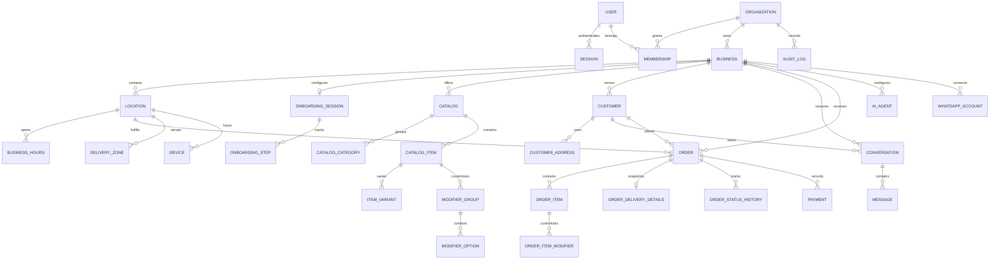

# MongoDB data model

Use a dedicated `lumia_order` database in the existing Lumia MongoDB cluster. Collection names are mapped in `prisma/schema.prisma`. IDs are UUID strings stored in `_id`, preserving the application's existing public identifier shape. These collections are independent of any existing Lumia ObjectId-based collections.

Prisma 6 uses `db push` for MongoDB indexes, not SQL migrations. `npm run db:setup` also creates partial unique indexes for optional provider identifiers and a TTL cleanup index for phone challenges. Expiration is always checked in application code, independently of TTL cleanup. Challenge documents remain for 24 hours so cleanup cannot reset hourly request limits early.

## Flexible catalogs and exact amounts

Catalog `layout` and item `metadata` are JSON documents for varying menu presentations and future attributes. Item names, categories, variants, and modifiers remain typed. Validation for each future layout belongs in its write service.

Money is stored as integer minor units: `basePriceMinor: 2800` means AED 28.00. Tax rates use integer basis points (`taxRateBps`), and coordinates use Float. Monetary calculations must use integers with explicit rounding policy; no floating-point totals. Current Prisma Int fields allow up to 2,147,483,647 minor units per value; larger business requirements require an explicit type change.

Orders retain item/modifier/address snapshots. Future order creation services must validate all referenced customer/location/catalog records against the authorized business. MongoDB does not enforce foreign keys.

## Authentication and tenancy

User phone numbers are required, normalized E.164, and unique. Accounts are created only after successful code verification. A synthetic internal email satisfies the authentication library contract; it is not a verified contact address. Phone challenges contain a digest, nonce, expiry, attempts, resend timestamp, send-window counters, language and delivery state. OTP plaintext is never persisted.

These are application relationships, not database-enforced foreign keys. `PhoneChallenge` is keyed by normalized phone; it deliberately exists before a User and has no required user relationship. Test and demo data from the former local PostgreSQL preview were not migrated into MongoDB.
